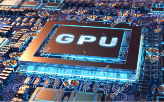
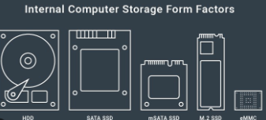
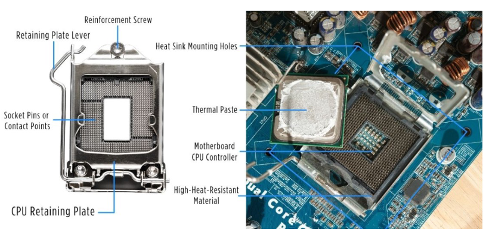

# OS-EX-1-Assembling-the-System---CASE-STUDY

## AIM:
To assemble the system.

## PROCEDURE:
### STEP-1: 
Prepare your workspace: Choose a clean, well-lit, and static-free area to work in. Place the motherboard on a non-conductive surface like its anti-static bag.

### STEP-2:
Install the CPU (Central Processing Unit): Align the CPU with the socket, ensuring the notches match.Gently place the CPU into the socket without applying any force.

 
 
 

### STEP-3:
Install the CPU Cooler: Attach the CPU cooler according to the manufacturer's instructions.

 

### STEP-4:
Install RAM (Random Access Memory): Align the notch on the RAM stick with the slot on the motherboard.

 

### STEP-5:
Install the GPU (Graphics Processing Unit): Align the GPU with the PCIe slot on the motherboard.

 
 
 

### STEP-6:
Install Storage Drives: Mount SSDs or HDDs in drive bays or brackets

 

### STEP-7:
Connect Cables: Connect all necessary cables: power cables, data cables, and front-panel connectors. Refer to your motherboard and case manuals for guidance.

 

### STEP-8:
Install the Power Supply: Ensure proper cable management to maintain good airflow.

 

### STEP-9:
Double-Check Connections: Ensure all connections are secure and properly seated.
 

### STEP-10:
Close the Case: Carefully close and secure the computer case using screws.

 

## RESULT:

The Computer System has been successfully assembled
